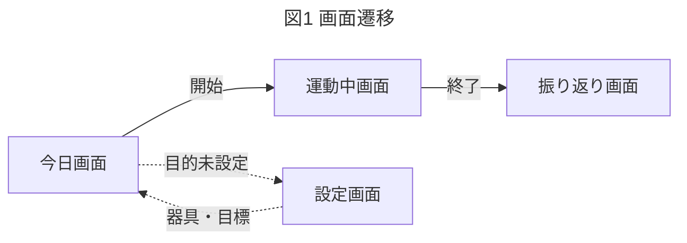
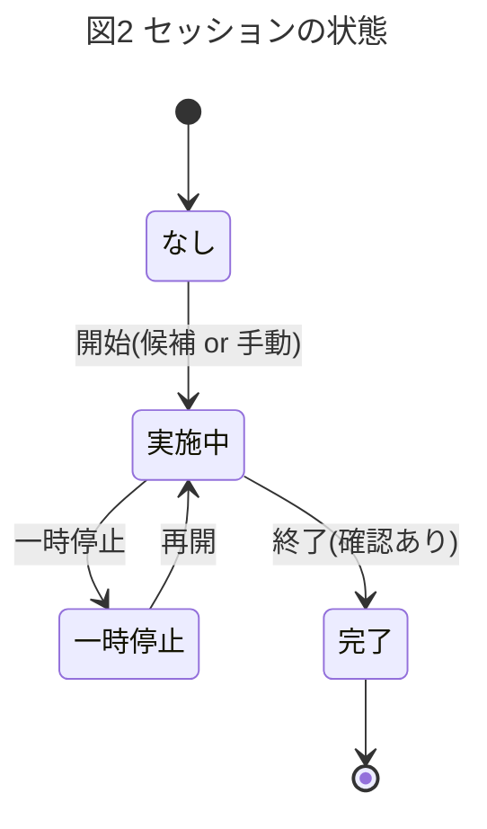
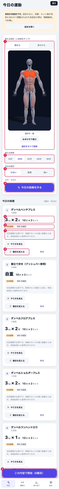
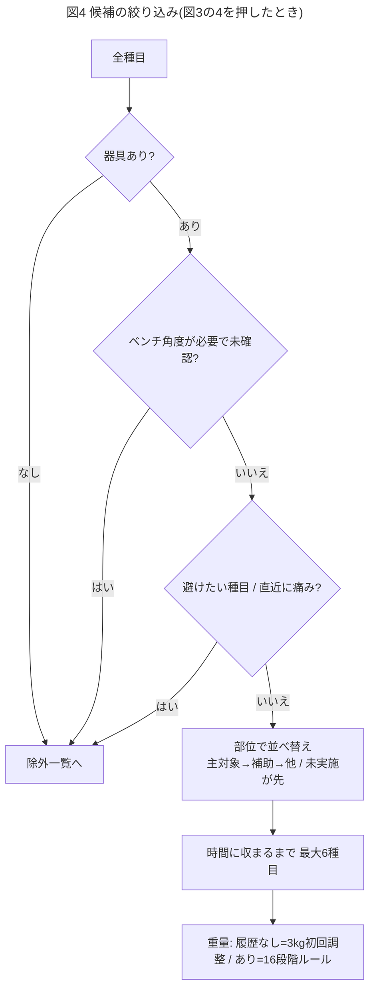
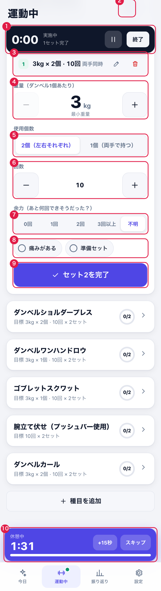
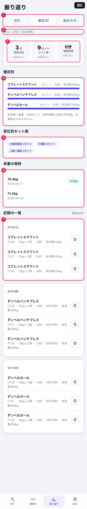
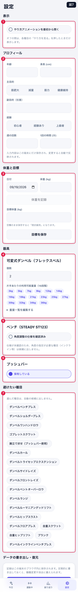
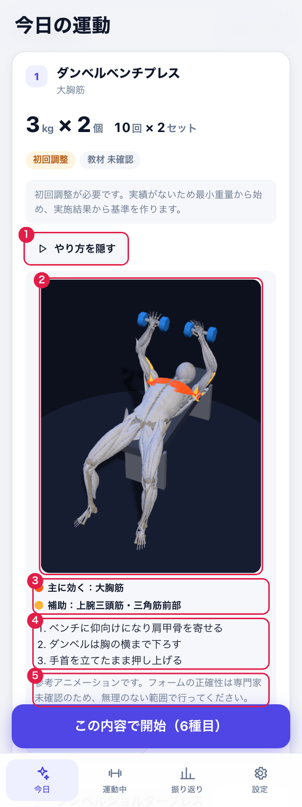
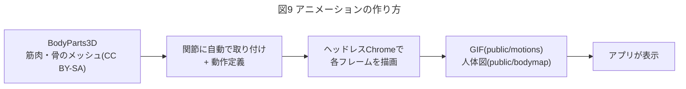

# 画面仕様書

スマホ向けWeb・個人利用。業務ルールは [計画書](../strength-app-plan.md)、実装ルールは [AGENT.md](../AGENT.md)。
参照は「図N」「表N」「図Nの番号」で示す。画像は `npm run docs:shots` で再生成できる。

## 1. 全体像

下部の4タブで切り替える(戻る操作なし)。運動中は「運動中」タブに緑の●、「今日」画面の最上部に再開バナーが出る。

## 2. 今日画面 — 候補を作って始める

**表1 図3の番号と動作**

| 番号 | 要素 | 動作 |
|---|---|---|
| 1 | 部位(人体図) | 解剖学モデルをタップして複数選択(前から/後ろから切替)。未選択=おまかせ。選ぶと該当の筋肉が光る |
| 2 | 使える時間 | 15〜90分。初期値=設定の「1回の時間」(なければ30) |
| 3 | 疲労 | 少ない/普通/強い。セッションに保存 |
| 4 | 候補を作る | 候補を生成。0件・例外は理由を赤枠で表示 |
| 5 | 目標値 | 重量(1個あたり)×個数、回数×セット |
| 6 | バッジ | 初回調整 / 教材 確認済み・未確認 |
| 7 | 提案理由 | ロジックが返す文章 |
| 8 | 種目を変える | シートで交換(提案値は再計算)。隣の「外す」で削除 |
| 9 | 開始 | 提案を保存し、運動中画面へ |

## 3. 運動中画面 — セットを記録する

**表2 図5の番号と動作**

| 番号 | 要素 | 動作 |
|---|---|---|
| 1 | セッションバー | 経過時間(時刻差から再計算)、一時停止/再開、終了(確認シート) |
| 2 | 進捗リング | 完了/目標セット。達成で次の種目が自動で開く |
| 3 | 記録済みセット | 編集 / 削除(6秒間「元に戻す」) |
| 4 | 重量 | 16段階の隣へ移動。最小3・最大36kgで停止 |
| 5 | 使用個数 | 2個(両手同時)/ 1個(両手で持つ)。片側種目は左右を選択(確定ごとに自動で反対側) |
| 6 | 回数 | ±1、直接入力可 |
| 7 | 余力 | あと何回できそうだったか(既定=不明) |
| 8 | 痛み・準備 | 表3 |
| 9 | 完了 | 保存+休憩開始。350ms以内の連打は1件のみ |
| 10 | 休憩 | 残り時間、+15秒、スキップ |

**表3 図5の7・8の役割**

| 入力 | 目的 | 影響 |
|---|---|---|
| 余力(7) | 重量が適切かを回数以外で判断 | 直近2回とも上限回数かつ余力2回以上のときだけ増量。余力0〜1回は1段階軽く。不明は増量しない |
| 痛み(8左) | 我慢して負荷を上げない安全装置(診断はしない) | 次回の自動候補から除外+理由表示。記録に赤バッジ |
| 準備セット(8右) | ウォームアップを本番と分ける | 記録は残る。集計・増量判定・進捗・休憩の対象外 |

## 4. 振り返り画面 — 集計と修正

**表4 図6の番号と内容**

| 番号 | 要素 | 内容 |
|---|---|---|
| 1 | 期間 | 前日 / 直近7日 / 直近1か月 |
| 2 | 範囲 | 期間の日付(日本時間)を常に表示 |
| 3 | 集計 | 実施日数・セット数・運動時間+前期間比(比較元0は「比較元なし」) |
| 4 | 種目別 | セット・回数・負荷量=重量×個数×回数(自重は対象外) |
| 5 | 部位別 | 主対象部位のみ加算 |
| 6 | 体重 | 直近5件と前回差。なければ「記録なし」 |
| 7 | 一覧 | 日付別、削除は「元に戻す」付き |

記録ゼロのときは空状態を表示(0や補完値で隠さない)。

## 5. 設定画面 — 入力は自動保存

**表5 図7の番号と内容**

| 番号 | セクション | 内容 |
|---|---|---|
| 1 | プロフィール | 年齢・身長・主目的・経験・頻度・時間 |
| 2 | 体重と目標 | 体重記録、目標体重(空欄=維持) |
| 3 | ダンベル | 個数、16段階(編集可・初期値に戻せる) |
| 4 | ベンチ | 角度仕様の確認済みトグル(初期=未確認) |
| 5 | プッシュバー | 保有トグル |
| 6 | 避けたい種目 | 選んだ種目は自動候補から除外 |
| 7 | 書き出し・復元 | JSON書き出し。復元は確認シート後に全置換。壊れたファイルはエラー |

## 6. やり方アニメーション — 初めてでも真似できる

**表6 図8の番号と動作**

| 番号 | 要素 | 動作 |
|---|---|---|
| 1 | やり方を見る/隠す | 種目ごとに開閉。既定は閉じる(知っている人の邪魔にならない) |
| 2 | 3Dモデルのアニメーション | 動作を繰り返すGIF。負荷がかかる部位を色で強調 |
| 3 | 凡例 | オレンジ=主に効く部位、黄=補助の部位 |
| 4 | フォームの要点 | 3点 |
| 5 | 注意 | 参考用で、フォームの正確性は専門家未確認 |

- 素材: 解剖学データ BodyParts3D(CC BY-SA)を加工。表示は設定画面の「クレジット」と [NOTICE](../NOTICE.md)。
- 表示場所: 今日画面の各候補カード(図3の5〜8の間)と、運動中画面の展開した種目(図5の3の上)。
- 「最初から開く」は設定画面の「表示」で切り替える(図7の上)。
- 読み込みに失敗しても案内だけを出し、記録は続けられる。

**表7 人体図(図3の1)**

| 操作 | 結果 |
|---|---|
| 筋肉をタップ | その部位を選択/解除(9部位: 胸・肩・上腕二頭筋・腹筋・太もも前・背中・上腕三頭筋・お尻・太もも裏) |
| 前から/後ろから | 向きを切替。選択は保持される |
| おまかせで選ぶ | 最も長く鍛えていない(未実施を優先)2部位を自動選択し、理由を表示 |
| 選択をすべて解除 | 未選択(全身おまかせ)に戻る |

## 7. 共通

**表8 共通仕様**

| 項目 | 仕様 |
|---|---|
| 表記 | ダンベルは常に「1個あたり」。「12kg × 2個」 |
| 時刻 | 日本時間 |
| テーマ | OS設定に追従(ライト/ダーク) |
| 操作 | 主要ボタン高さ44px以上、Escでシートを閉じる |
| 保存 | 端末のlocalStorage。他端末とは共有されない |

## 8. 未実装・未確認

- 痛み・最小重量時の「代替種目の案内」「中止導線」(ロジックは代替候補を返すが画面に未表示)
- 専門家によるアニメーション(フォーム)の確認。確認までは「参考」と表示し、教材の状態は「未確認」のまま
- スマホ実機での確認(エミュレーションのみ)
- 画面を閉じた後の休憩通知
