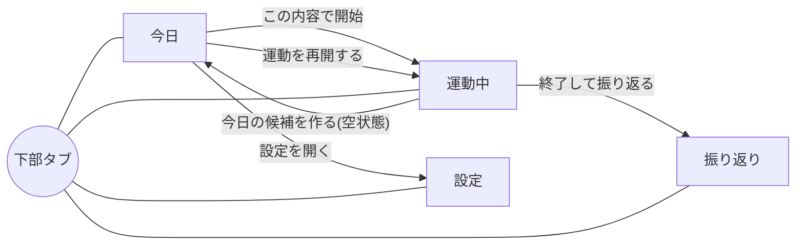
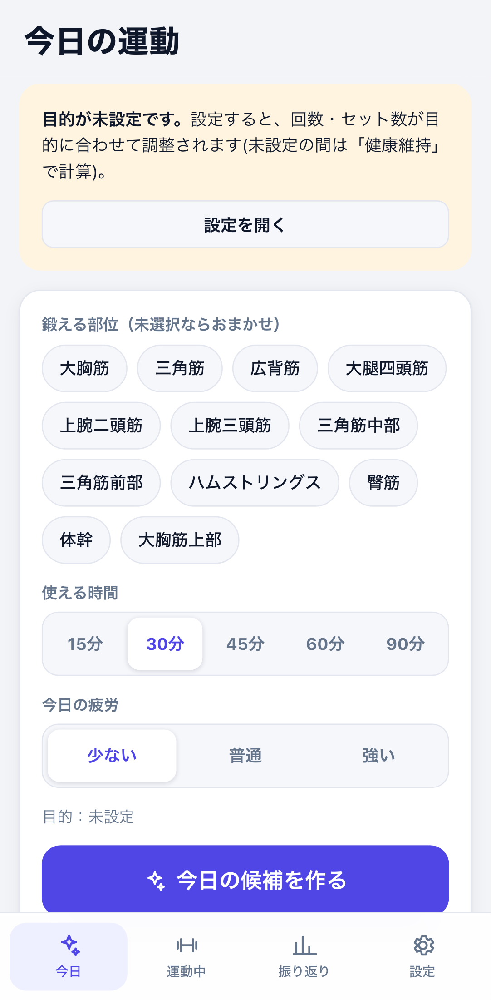
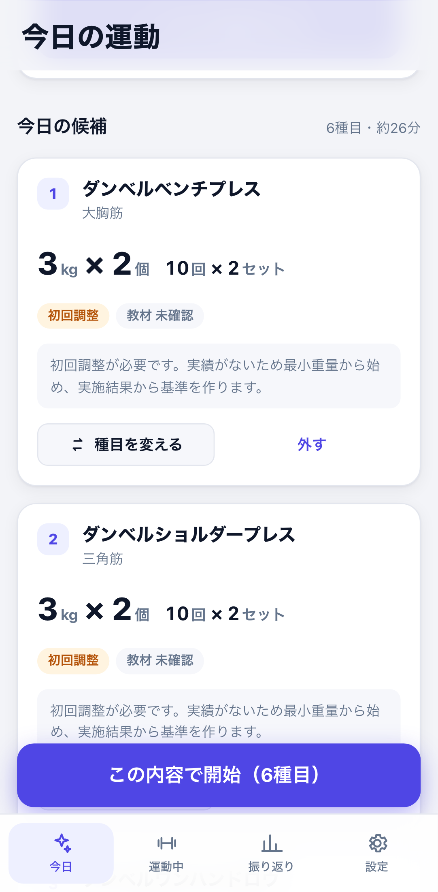
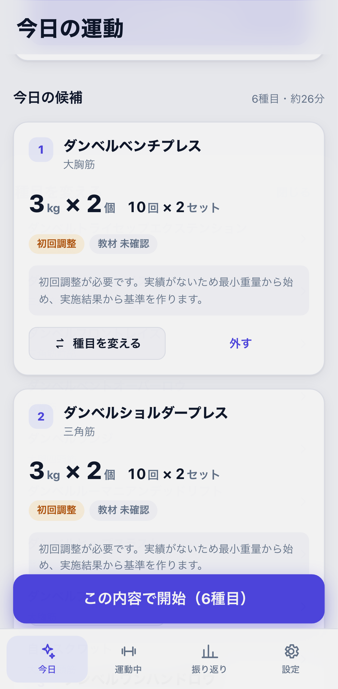
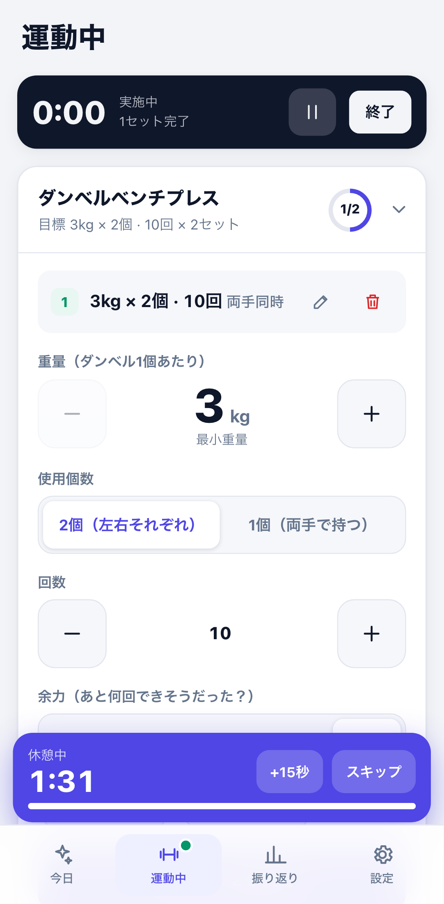
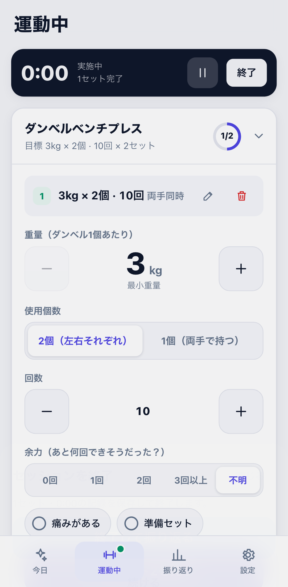
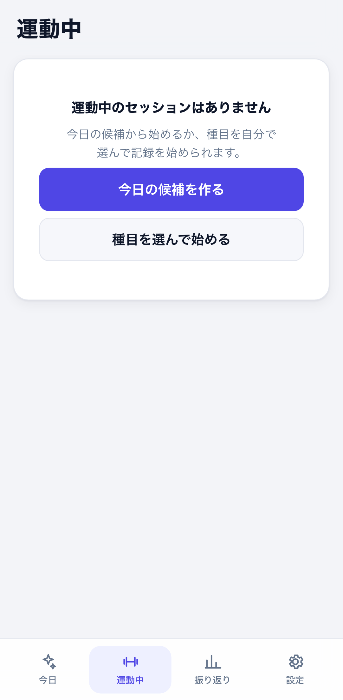
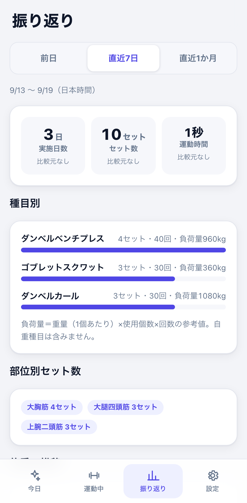
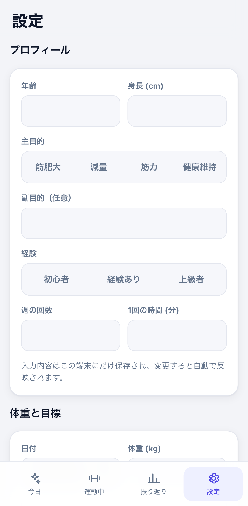
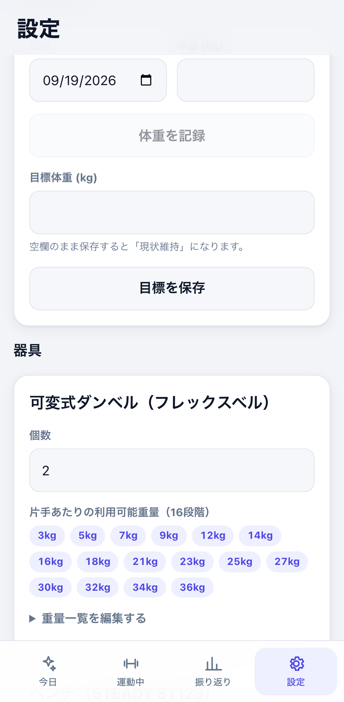

# 画面仕様書

筋トレ記録アプリ(スマホ向けWeb・個人利用)の画面仕様。業務仕様・提案ロジックの定義は [strength-app-plan.md](../strength-app-plan.md)、実装ルールは [AGENT.md](../AGENT.md) を参照。
本書は実装(2026-09-19時点)に基づく。スクリーンショットは幅412px(Pixel 7相当)のライトテーマ。

## 1. 画面構成と遷移

| ID | 画面 | タブ | 目的 |
|---|---|---|---|
| S1 | 今日 | 今日 | 部位・時間・疲労を入力し、今日の種目候補を作って開始する |
| S2 | 運動中 | 運動中 | セッション中にセットを記録し、時間・休憩を管理する |
| S3 | 振り返り | 振り返り | 期間集計・体重推移・記録一覧の確認と修正 |
| S4 | 設定 | 設定 | プロフィール・目標・器具・避けたい種目・書き出し/復元 |

- 起動時は常にS1。アクティブなセッションがあれば、S1に再開バナー、下部「運動中」タブに緑の●が出る。
- 画面遷移はタブ切替(履歴スタックなし)。ブラウザの戻る操作は使わない。

## 2. 共通仕様

### 2.1 レイアウト
- 最大幅520px・中央寄せ。左右余白16px。上部に固定ヘッダー(画面タイトル)、下部に固定タブバー(4タブ)。
- セーフエリア(ノッチ・ホームバー)に対応。横スクロールは発生させない。
- テーマはOS設定に追従(ライト/ダーク)。`prefers-reduced-motion`ではアニメーションを無効化。
- 最小タップ領域: 主要ボタン・ステッパー・セグメントは高さ44px以上(入力欄52px、ステッパー64px)。

### 2.2 共通部品
| 部品 | 仕様 |
|---|---|
| セグメント | `radiogroup`/`radio`。単一選択。選択中は白背景+アクセント色 |
| チップ | 複数選択トグル(`aria-pressed`)。部位・避けたい種目で使用 |
| トグル | ON/OFFの丸型ボタン(`aria-pressed`)。痛み・準備セット・ベンチ確認等 |
| ステッパー | 左右に−/＋、中央に大きな値。重量は登録済み16段階の隣へ移動、回数は±1 |
| ボトムシート | 下からせり上がるダイアログ。背景タップ・「閉じる」・Escで閉じる |
| トースト | 画面下(タブバー上)に6秒表示。「元に戻す」等のアクション付きにできる |
| 空状態 | タイトル+説明+(あれば)行動ボタン。データなしを「0」や補完値で隠さない |
| エラー表示 | 赤系カード/バッジ+`role="alert"`。原因と次の行動を文章で示す |

### 2.3 用語・表記(必ず統一)
- ダンベルの重量は常に**1個あたり**。「3kg × 2個」(2個使用)、「12kg × 1個」(1個を両手で持つ)。
- 回数の右に「セット」。左右は「左/右」、2個同時は「両手同時」、区別なしは表示しない。
- 教材は「確認済み」「未確認」を明示。未確認を確認済みと表示しない。
- 日時はすべて日本時間(Asia/Tokyo)。

## 3. S1 今日

| 01 初期表示 | 02 候補作成後 | 03 種目交換シート |
|---|---|---|
|  |  |  |

### 3.1 表示要素(上から)
1. **再開バナー**(アクティブセッションがある場合のみ): 「運動を再開する」→ S2。
2. **目的未設定の案内**(主目的が未設定の場合のみ): 「設定を開く」→ S4。未設定の間は「健康維持」で計算する旨を表示。
3. **入力カード**
   - 鍛える部位: チップ複数選択(0件=おまかせ)。選択肢は登録種目の主対象部位から生成。
   - 使える時間: セグメント 15/30/45/60/90分。初期値は設定の「1回の時間」、未設定なら30分。
   - 今日の疲労: セグメント 少ない/普通/強い(セッションに保存)。
   - 目的の表示、主ボタン「今日の候補を作る」。
4. **エラー/0件カード**: 例外時「候補を作れませんでした:…」、0件時「条件に合う種目がありません…」(`role="alert"`)。
5. **今日の候補**: 見出し「N種目・約M分」。各カード:
   - 番号・種目名・主対象部位
   - 目標値: 重量「3kg × 2個」(自重種目は「自重」)と「10回 × 2セット」
   - バッジ: 「初回調整」(履歴なし)、「教材 確認済み/未確認」
   - 提案理由(ロジックが返した文章)
   - 「種目を変える」(→シート)、「外す」
6. **開始ボタン**(候補1件以上): 「この内容で開始（N種目）」。下部に固定表示。
7. **除外した種目**(折りたたみ): 「種目名:理由」の一覧。

### 3.2 動作
| 操作 | 結果 |
|---|---|
| 今日の候補を作る | ロジック層(`buildProposal`)で候補生成。成功後、結果位置へスクロール |
| 種目を変える | 交換可能な種目をシートに一覧(候補外・利用可能なもののみ)。選ぶとその種目の提案値を再計算して置換 |
| 外す | その種目を候補から削除。開始ボタンの種目数も更新 |
| この内容で開始 | 提案を保存→セッション作成(状態=実施中、疲労、提案ID)→S2へ |

### 3.3 候補生成のルール(画面に影響する点)
- 除外: 器具未登録、ベンチ角度が必要でベンチ未確認、避けたい種目、直近の実績に痛みあり。理由は除外一覧に表示。
- 並び順: 選択部位の主対象 → 補助一致 → その他。同順位は最終実施が古い(未実施)順。
- 時間: 種目ごとの概算所要時間の合計が使える時間に収まるまで、最大6種目。
- 重量: 履歴なし=最小重量(3kg)で「初回調整」。履歴あり=16段階のルールで増量/据え置き/減量(詳細は計画書§5)。

### 3.4 状態
| 状態 | 表示 |
|---|---|
| 初期 | 入力カードのみ |
| 候補あり | 候補カード+開始ボタン |
| 0件 | エラーカード+除外一覧 |
| 例外 | エラーカード(原因を文章表示) |

## 4. S2 運動中

| 04 記録中 | 05 終了確認 | 09 セッションなし |
|---|---|---|
|  |  |  |

### 4.1 セッションなしの状態
- 空状態カード。「今日の候補を作る」→ S1。「種目を選んで始める」→ 候補なしでセッションを作成し、種目追加シートを開く(手動選択)。

### 4.2 セッションバー(画面上部に固定)
- 経過時間(m:ss / h:mm:ss)、状態(実施中/一時停止中)、完了セット数、一時停止/再開ボタン、「終了」ボタン。
- 経過時間は開始時刻と一時停止区間から毎秒再計算する。画面を閉じて戻っても、再読込しても継続する(カウントアップ方式ではない)。

### 4.3 種目カード(アコーディオン)
ヘッダー: 種目名、目標(候補から開始した場合「目標 3kg × 2個 · 10回 × 2セット」)、進捗リング(完了/目標セット。達成でチェック)。目標がない種目は「Nセット」バッジ。
展開時の本体(上から):
1. 前回実績(別セッションの直近): 「前回:12kg × 2個 · 10回」
2. 記録したセット一覧: 番号・「重量 × 個数 · 回数 左右」・バッジ(準備/痛み)・編集・削除
3. 重量ステッパー(ダンベル種目のみ): 16段階の隣へ移動。最小/最大で無効化し「最小重量/最大重量」を表示
4. 使用個数(両手同時・両手持ちの区別が必要なダンベル種目): セグメント「2個（左右それぞれ）/1個（両手で持つ）」。2個=両手同時、1個=区別なし
5. 左右(片側種目): セグメント 左/右。セット確定ごとに自動で反対側へ切替
6. 回数ステッパー: 直接入力可、最小1。プランクのみ「秒数」
7. 余力: セグメント 0/1/2/3回以上/不明(既定=不明。不明を0として扱わない)。「あと何回できそうだったか」の自己申告で、次回の増量判断に使う(§4.6)
8. トグル(§4.6に目的と影響を記載)
   - 痛みがある(赤): このセットで痛みを感じたときにON
   - 準備セット: 本番前のウォームアップとして行ったセットのときにON
9. 主ボタン「セットNを完了」(編集中は「この内容に更新」+「やめる」)

### 4.4 動作・ルール
| 操作 | 結果 |
|---|---|
| セット完了 | セット実績を保存(重量は1個あたり、個数、左右、回数、余力、痛み、準備、完了時刻)。準備セット以外は休憩バー開始(目的別秒数) |
| 二重タップ | 350ms以内の連続タップは1件のみ記録(新規追加のみ) |
| 目標セット数に到達 | 次の未完了種目を自動で展開 |
| 編集 | セットの内容をフォームに読み込み、更新で上書き(更新版を加算)。削除・再集計は即時反映 |
| 削除 | 論理削除+トースト「元に戻す」(6秒) |
| 種目を追加 | シートに未表示の種目を一覧。ベンチ角度が必要で未確認の種目は無効(理由付き)。痛みの申告がある種目は選べるが注意を表示 |
| 一時停止/再開 | 一時停止区間を記録。停止中は経過時間が進まない |
| 終了 | 確認シート(セット数・時間)→「終了して振り返る」で保存し S3 へ。「続ける」で戻る |

### 4.5 休憩バー(画面下に固定、タブバー上)
- 残り時間(m:ss)、進捗バー、「+15秒」「スキップ」。0になると自動で消える。
- 休憩中はフォーム末尾に余白を確保し、完了ボタンと重ならないようにする。
- 休憩時間: 筋力150秒 / 筋肥大90秒 / 健康維持90秒 / 減量60秒(仮設定・専門家未確認)。

### 4.6 入力項目の目的と影響(余力・痛み・準備セット)

セット記録の負担を増やしてでも入力させる項目には、次の理由がある。3項目とも既定はOFF/不明で、入力しなくても記録できる。

| 項目 | なぜあるか | 入力するとどうなるか |
|---|---|---|
| 余力 | 重量・回数が「ちょうどよかったか」は、回数だけでは分からない。あと何回できそうだったかで、余裕のある重量と限界の重量を区別する | 増量提案の条件に使う。直近2回の実施で全セットが目的の回数上限に達し、かつ余力が2回以上のときだけ、次の登録重量へ増量候補を出す。余力が足りない(直近のセットが余力0〜1回、または回数が下限未満)ときは、1段階軽い登録重量へ下げる候補を出す(最小重量なら代替種目の検討を促す文言のみ)。「不明」は増量条件を満たさない扱いで据え置く(不明を0や余裕ありと推測しない) |
| 痛みがある | 痛みを我慢して重量・回数を上げ続けるのを防ぐ安全装置。本アプリは診断や治療を行わないため、「痛みがあった」という事実だけを記録し、その先の提案を止める | ①その種目を今日の自動候補から除外し、除外一覧に「前回痛みの申告があった」と理由を表示する。これにより痛みのある種目が増量提案されることはない(提案ロジック自体も、痛みがあれば増量せず据え置く) ②手動の「種目を追加」では選べるが、注意を表示する ③記録一覧に赤い「痛み」バッジを付ける。医学的な判断や治療法は表示しない |
| 準備セット | 軽い重量で体を慣らすウォームアップは、本番の負荷とは別物。本番と混ぜると、実施セット数・負荷量が水増しされ、増量の判定も狂う | 記録は残すが、①セット数・種目別・部位別・負荷量の集計に含めない ②増量判定・前回実績・提案の根拠に含めない ③目標セットの進捗に数えない ④完了しても休憩タイマーを始めない |

## 5. S3 振り返り

| 06 振り返り |
|---|
|  |

### 5.1 表示要素
1. 期間セグメント: 前日 / 直近7日(既定) / 直近1か月。期間の範囲「9/13 〜 9/19（日本時間）」を必ず表示。
2. 集計カード: 実施日数・セット数・運動時間。各項目に前期間(同日数)との差(比較元が0なら「比較元なし」、差が0なら「前期間と同じ」)。
3. 種目別: セット数・回数・参考負荷量(バー付き)。負荷量=重量(1個あたり)×使用個数×回数。自重種目は負荷量を出さない。
4. 部位別セット数: 主対象部位のみ加算(補助部位は加算しない)。
5. 体重の推移: 直近5件と前回差。なければ「記録なし(設定タブで体重を記録できます)」。
6. 記録の一覧(最新60件): 日付ごとのカード。時刻・種目・重量×個数・回数・左右・負荷量・準備。行ごとに削除(トースト「元に戻す」)。

### 5.2 集計ルール
- 完了・未削除の本番セットのみ対象(準備セット・削除済みは除外)。
- 期間: 前日=前日0時〜当日0時、直近7日=今日を含む7暦日、直近1か月=1か月前の同日の翌日〜今日(月末は存在する最終日に補正)。すべてJST。
- 運動時間=休憩を含み一時停止を除く。日跨ぎは日ごとに配賦。
- 実績がまったくない場合は空状態「まだ記録がありません」(集計カードは出さない)。

## 6. S4 設定

| 07 プロフィール | 08 器具 |
|---|---|
|  |  |

入力は変更ごとに自動保存(保存ボタンなし)。

| セクション | 項目・動作 |
|---|---|
| プロフィール | 年齢、身長、主目的(筋肥大/減量/筋力/健康維持)、副目的(任意)、経験、週の回数、1回の時間 |
| 体重と目標 | 日付+体重の記録(体重が空/0以下は無効)。目標体重(空欄で保存=現状維持)。現在の目標を表示 |
| 器具: ダンベル | 個数(初期2)。片手あたりの重量一覧を16個のバッジで表示。「重量一覧を編集する」(折りたたみ)で編集、「初期の16段階に戻す」。不正入力は「正の数をカンマ区切りで…」を表示 |
| 器具: ベンチ | 「角度調整の仕様を確認済み」トグル(初期=未確認)。未確認の間は角度が必要な種目を候補に出さない旨を表示 |
| 器具: プッシュバー | 「保有している」トグル(初期=ON) |
| 避けたい種目 | 種目チップの複数選択。選んだ種目は自動候補から除外 |
| 書き出し・復元 | 「データを書き出す」=JSONダウンロード。「バックアップから復元する」=ファイル選択→確認シート「現在のデータはすべて置き換えられます」→「復元する」。壊れたファイルはエラー表示し復元しない |

初期値(確定事項): フレックスベル2個、重量 3,5,7,9,12,14,16,18,21,23,25,27,30,32,34,36kg。ベンチ STEADY ST123(角度未確認)。プッシュバーあり。

## 7. データ保存とエラー
- 保存先は端末のブラウザ内(localStorage、キー `strength-app-data-v1`)。変更のたびに全体を保存。他端末とは共有されない。
- 復元時は種目定義を最新のシードで補い、実績・設定は保持。
- 保存領域が消えた場合に備え、書き出しを定期的に行うことを設定画面の文言で案内する。
- 実行時エラー: S1の候補作成は画面内にメッセージを表示。それ以外の予期しないエラーは未対応(空白画面になり得る。再読込で復旧)。

## 8. アクセシビリティ
- 操作要素は役割とラベル(`aria-label`/`aria-pressed`/`aria-expanded`/`aria-current`)を持つ。ステッパーの値は`aria-live`。
- フォーカスリングを表示。シートはEscで閉じる。
- 色だけに依存しない(痛み・エラーは文言も併記)。本文コントラストは7:1超(ダークテーマで検証)。

## 9. 対象外・未確認
- 画面をスマホ実機(iOS/Android)で確認していない(ブラウザのモバイル幅エミュレーションのみ)。
- 教材(動画)の表示画面は未実装(教材の確認状態のみ表示)。種目詳細画面(フォームの要点・よくある誤り)は現在UIに出していない(データは保持)。
- 痛み申告後・最小重量でも困難な場合の「代替種目の案内」「中止導線」は、ロジックは代替候補を返すが画面には出していない(未実装。計画書§5の中止導線の残課題)。
- 画面を閉じた後の休憩通知は行わない(復帰時に残り時間を再計算)。
- 認証・同期・公開関連の画面は対象外。
